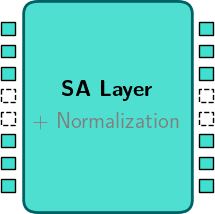
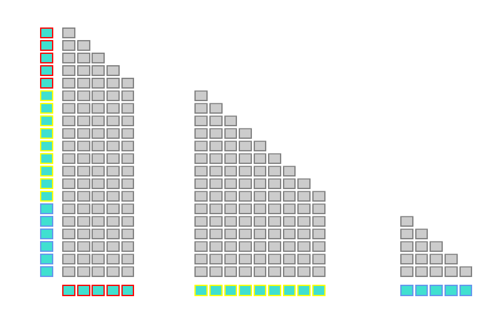
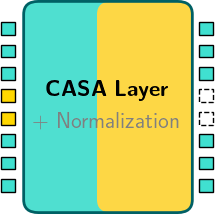
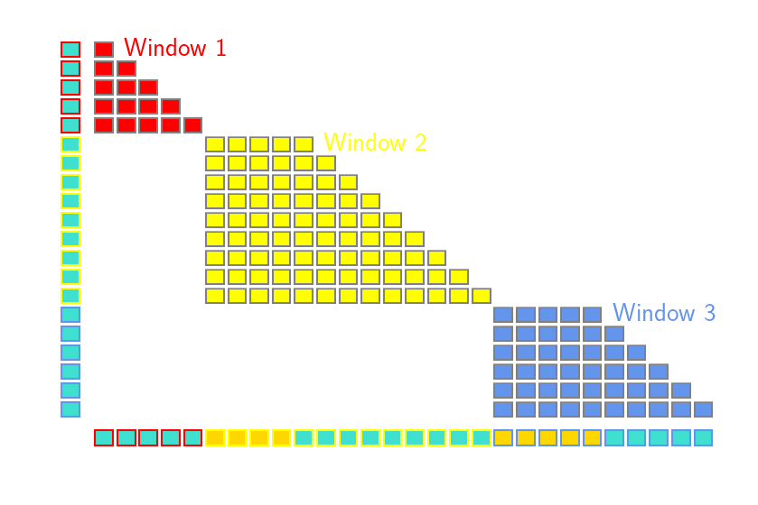

# CASA: Cross-Attention via Self-Attention for Efficient Vision-Language Fusion

[[Preprint]][casa-arxiv] [[Models on Hugging Face]](https://huggingface.co/collections/kyutai/casa) [[Project Page]][blog]

This repository contains inference code for pretrained CASA models; We are planning to release training code in the future. Alongside the code, we release several CASA variants with 2B to 3B parameters, which can be found in the following [HuggingFace collection](https://huggingface.co/collections/kyutai/casa). Below you can find example code to run the models, evaluate them and use them for live captioning of videos.

For more technical details on CASA, see our [project page][blog] and [preprint][casa-arxiv].

## CASA in a nutshell

<table align="center">
  <tr>
    <td align="center" width="49%">
      
      
      <br>
      <em><strong>(i)</strong> Standard self-attention layer</em>
    </td>
    <td align="center" width="49%">
      
      
      <br>
      <em><strong>(ii)</strong> CASA layer w/ local attention windows</em>
    </td>
  </tr>
</table>

**CASA** is a vision-language fusion paradigm that aims to improve on cross-attention while preserving its practical benefits. Specifically, **CASA** layers inject visual tokens into a text stream by using image-to-text cross-attention while additionally enabling
text-to-text self interaction in the same layer, and contained to smaller local attention windows. This simple modification enables natural gating in the cross-attention mechanism, improving its performance and substantially closing the gap to standard token insertion methods.

CASA models process and fuse vision and text inputs through two mechanisms:

- **(i)** Standard self-attention layers process only the text tokens, for the full context of the current sequence (_right_).
- **(i)** CASA layers process _both_ text and image tokens but in local attention windows (_left_). The windows are defined by the points at which images occur in the stream, e.g. between two video frames. To improve efficiency, CASA layers also leverage _asymmetric block-wise attention_ implemented using Flash Attention.

## Models

We release CASA models for both image-based and video streaming settings, based on two backbones:

- [**Helium1-2B**](https://huggingface.co/kyutai/helium-1-2b), a **text-only LLM** which we fully fine-tune alongside CASA layers to produce a VLM which uses CASA fusion rather than token insertion.
- [**Qwen2.5-VL-3B**](https://huggingface.co/Qwen/Qwen2.5-VL-3B-Instruct), a **pretrained VLM** which originally handles visual inputs by directly adding image tokens to its token stream. In this setting we keep the backbone VLM frozen and adapt it to CASA by training only the additional CASA layers.

In both cases, images are embedded using the Qwen2.5-VL visual encoder, whose last four blocks are fine-tuned before feeding visual features into CASA.

### Image-based Models

All models we release are first trained on a combination of:

- the [FineVision dataset](https://huggingface.co/spaces/HuggingFaceM4/FineVision), and
- a subset of [LLaVA-OneVision-1.5](https://huggingface.co/collections/lmms-lab/llava-onevision-15),

These two datasets together cover a wide range of tasks including image captioning, document and chart understanding, and general visual question answering.

> 🔹 **CASA models**  
> We release **`kyutai/CASA-Helium1-VL-2B`** and **`kyutai/CASA-Qwen2_5-VL-3B`**, pretrained on this image-based training set.

> 🔹 **Token insertion baseline**  
> In addition to CASA-based models, we release **`kyutai/Helium1-VL-2B`**, a VLM based trained from Helium1-2B with direct token insertion. `Helium1-VL-2B` achieves state-of-the-art performance among insertion-based models of comparable size trained with publically available datasets.

### Video Captioning Model

For live video captioning, we further fine-tune our `CASA-Qwen2_5-VL-3B` models on the  
[Live-WhisperX-526K](https://huggingface.co/datasets/chenjoya/Live-WhisperX-526K) dataset, which is an instruction-style video dataset for live captioning, consisting of video frames sampled at 2 fps and interleaved with the corresponding text transcripts of the original video audio.

> 🔹 **LiveCC CASA models.**  
> We release **`CASA-Qwen2_5-VL-3B-LiveCC`**, further finetuned on Live-WhisperX for live streaming.

## Using the models

### Setup

We recommend using [uv](https://docs.astral.sh/uv/) to setup and run the code,
as it will manage all Python dependencies for you transparently.

`uv` is provided as a lightweight binary which can be installed as follows:

```bash
curl -LsSf https://astral.sh/uv/install.sh | sh
```

We provide a `pyproject.toml` with the minimal dependencies required to run inference with CASA models.

### Quick Start

Below is a short snippet to show you how to load our models, process inputs, and run inference, using a standard HuggingFace `transformers` pipeline and chat template.

```python
import torch
from transformers.models.auto.modeling_auto import AutoModel
from transformers.models.auto.processing_auto import AutoProcessor

model_id = "kyutai/CASA-Helium1-VL-2B"
model = AutoModel.from_pretrained(
    model_id,
    torch_dtype=torch.bfloat16,
    attn_implementation="flash_attention_2",
    trust_remote_code=True,
).cuda()
processor = AutoProcessor.from_pretrained(
    model_id,
    trust_remote_code=True,
)

conversation = [
    {
        "role": "user",
        "content": [
            {
                "type": "image",
                "image": "assets/casa_model.png",
            },
            {
                "type": "text",
                "text": "Describe this image.",
            },
        ],
    },
]
inputs = processor.tokenize_messages(messages=conversation)
inputs = inputs.to(model.device)
input_len = inputs["input_ids"].shape[1]
output_ids = model.generate_from_image(
  **inputs,
  max_new_tokens=512,
  pre_image_tokens=processor.pre_image_tokens,
  post_image_tokens=processor.post_image_tokens,
  eos_token_id=model.generation_config.eos_token_id,
)[0, input_len:]
response = processor.tokenizer.decode(output_ids, skip_special_tokens=True)
print(response)
```

### Live Captioning

We provide a script to caption a video using our `CASA-Qwen2_5-VL-3B-LiveCC` model and generate the resulting video with subtitles embedded at the actual time they are generated.

Note that you will also need to install `ffmpeg` for this script to run. The Python dependencies are handled with `uv`

```bash
# Script options
uv run scripts/gen_livecc_subtitles.py --help
# Generation with Qwen2.5VL+CASA
uv run scripts/gen_livecc_subtitles.py --sample_path path_to_video.mp4 --srt True --temp 0.0
# For long videos, you can also tweak the repetition penalty more precisely
uv run scripts/gen_livecc_subtitles.py --sample_path path_to_long_video.mp4 --repetition_penalty 1.15 --repetition_penalty_max_count 10 --repetition_penalty_decay 0.9
```

Additional qualitative samples are available on our associated [project page][blog].

<div align="center">
<p align="center" width="100%">
<video src="https://github.com/user-attachments/assets/cb205fe2-11fb-4e8d-98ac-e1a250e5573b" width="80%" controls></video>
</p>
<p>
 The input video is taken from the Animal Kingdom dataset, and the subtitles displayed are generated with <code>CASA-Qwen2_5-VL-3B-LiveCC</code>.

Specifically, video frames are extracted at 2fps, and subtitles are displayed in real-time at the timestamp they are generated< </p>

  <p><small> <i><b>Transcript:</b> "This video shows a fox in the Arctic. The Arctic is an area of Earth that's covered by ice and snow year -round, and it gets very cold there. Foxes are adapted to live in this cold environment because they have a thick layer of fur to keep them warm when they're out in the snow. This fox is walking through the snow and looking around for food or maybe just for safety from predators like wolves or bears that might be around. Foxes are also known for their ability to jump really high and"</i></small></p>
</div>

### Benchmark Evaluation

We also provide a script for reproducing our reported results on standard VLM benchmark. We use [lmms-eval](https://github.com/EvolvingLMMs-Lab/lmms-eval) as our main evaluation pipeline.

```bash
# Display command options
uv run scripts/inference.py --help
# Run inference on the ai2d dataset for the Helium1+CASA model
uv run scripts/inference.py CASA-Helium1-VL-2B --dataset_name ai2d
# Evaluate on all datasets sequentially
bash script/eval.sh CASA-Helium1-VL-2B
```

Using this pipeline, we evaluate our models `CASA-Helium1-VL-2B`, <span className="text-gray-400">`Helium1-VL-2B`</span>, and `CASA-Qwen2_5-VL-3B`
on a range of benchmarks covering document understanding (`DocVQA`), chart understanding (`ChartQA`, `InfoVQA`),
visual text reading (`TextVQA`, `OCRBench`), and general QA (`RealWorldQA`, `AI2D`, `GQA`, `MME`). Results are reported below. Please refer to our [project page][blog] and [arxiv paper][casa-arxiv] for additional evaluation.

<small>
<table style="border-collapse: collapse;">
<tr>
<th rowspan="2" align="left">Model</th>
<th colspan="3" align="center">Document / Chart</th>
<th colspan="2" align="center">Scene Text</th>
<th colspan="4" align="center">Knowledge / QA</th>
</tr>
<tr>
<th>ChartQA</th>
<th>DocVQA</th>
<th>InfoVQA</th>
<th>OCRBench</th>
<th>TextVQA</th>
<th>RealWorldQA</th>
<th>AI2D</th>
<th>GQA</th>
<th>MME</th>
</tr>
</thead>
<tbody>
<tr>
<td align="left">Helium1-VL-2B</td>
<td>81.6</td><td>89.1</td><td>61.8</td>
<td>728</td><td>75.5</td>
<td>59.9</td><td>67.7</td><td>55.5</td><td>1732</td>
</tr>
<tr>
<td align="left"><span style="color:#fb923c;"><strong>CASA-Helium1-VL-2B</strong></span></td>
<td>73.4</td><td>83.7</td><td>48.6</td>
<td>723</td><td>71.0</td>
<td>58.3</td><td>63.3</td><td>54.6</td><td>1572</td>
</tr>
<tr>
<td align="left"><span style="color:#60a5fa;">mPLUG-Owl3 8B</span></td>
<td>59.2<sup>†</sup></td><td>55.9<sup>†</sup></td><td>36.8<sup>†</sup></td>
<td>527<sup>†</sup></td><td>69.0</td>
<td>63.9<sup>†</sup></td><td>73.4</td><td>65.0</td><td>1940<sup>†</sup></td>
</tr>
<tr>
<td align="left"><span style="color:#60a5fa;">mPLUG-Owl3 2B</span></td>
<td>48.5<sup>†</sup></td><td>48.2<sup>†</sup></td><td>28.1<sup>†</sup></td>
<td>450<sup>†</sup></td><td>62.6</td>
<td>56.9<sup>†</sup></td><td>62.6</td><td>61.0</td><td>1551<sup>†</sup></td>
</tr>
</tbody>
</table>
<p>
<sup>†</sup> Reproduced with the publicly available models on Hugging Face. &ensp; 
<!-- ◇ Results and model not publicly available. -->
</p>

<p align="center">
<em>
Results for <code>CASA-Helium1-VL-2B</code> compared to a recent cross-attention baseline (blue), and our token insertion
(<code>Helium1-VL-2B</code> trained in the same conditions. CASA outperforms current SoTA
cross-attention-based VLMs, narrowing the gap to insertion-based approaches.
</em>
</p>
</small>

<small>
<table style="border-collapse: collapse;">
<thead>
<tr>
  <th rowspan="2" align="left">Model</th>
  <th colspan="3" align="center">Document / Chart</th>
  <th colspan="2" align="center">Scene Text</th>
  <th colspan="4" align="center">Knowledge / QA</th>
</tr>
<tr>
  <th>ChartQA</th>
  <th>DocVQA</th>
  <th>InfoVQA</th>
  <th>OCRBench</th>
  <th>TextVQA</th>
  <th>RealWorldQA</th>
  <th>AI2D</th>
  <th>GQA</th>
  <th>MME</th>
</tr>
</thead>

<tbody>
<tr>
  <td align="left">
    Qwen2.5-VL-3B
  </td>
  <td>84.0</td><td>93.6</td><td>77.1</td>
  <td>797</td><td>79.3</td>
  <td>62.2<sup>†</sup></td><td>81.6</td><td>61.0<sup>†</sup></td><td>2249<sup>†</sup></td>
</tr>
<tr>
  <td align="left">
    <span style="color:#fb923c;"><strong>CASA-Qwen2_5-VL-3B</strong></span>
  </td>
  <td>82.4</td><td>88.9</td><td>59.6</td>
  <td>790</td><td>77.4</td>
  <td>62.5</td><td>75.1</td><td>59.4</td><td>1918</td>
</tr>
</tbody>
</table>

<p>
<sup>†</sup> Reproduced with the publicly available models on Hugging Face.
</p>

<p align="center">
<em>
Results for <code>CASA-Qwen2_5-VL-3B</code>, adapted from frozen Qwen2.5-VL. CASA reaches performance close to the original
insertion-based model while while training only
the CASA layers and last blocks of the image encoder.
</em>
</p>
</small>

## License

The present code is provided under the **MIT license**.

The weights for the models are released under the **CC-BY-NC-SA 4.0 license**.

Some of the model weights include weights from the Qwen2.5-VL-3B model (namely, the image encoder for CASA-Helium1-VL-2B and Helium1-VL-2B, as well as the VLM backbone for CASA-Qwen2_5-VL-3B and CASA-Qwen2_5-VL-3B-LiveCC). Qwen is licensed under the **Qwen RESEARCH LICENSE AGREEMENT**, Copyright (c) Alibaba Cloud. All Rights Reserved.

## Citation

If you use CASA in your research, please cite our work:

```
@article{kyutai2025casa,
  author = {Moritz B\"ohle and Am\'elie Royer and Juliette Marrie and Edouard Grave and Patrick P\'erez},
  year = {2025},
  title = {CASA: Cross-Attention via Self-Attention for Efficient Vision-Language Fusion},
  journal = {ArXiv},
  url = {}
}
```

[blog]: https://kyutai.org/casa
[casa-arxiv]: https://arxiv.org/abs/2512.19535
