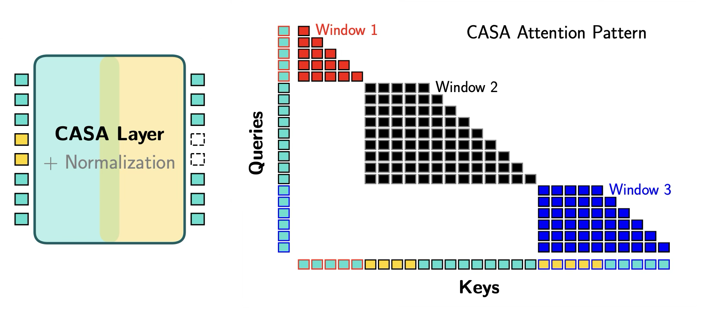
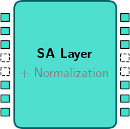
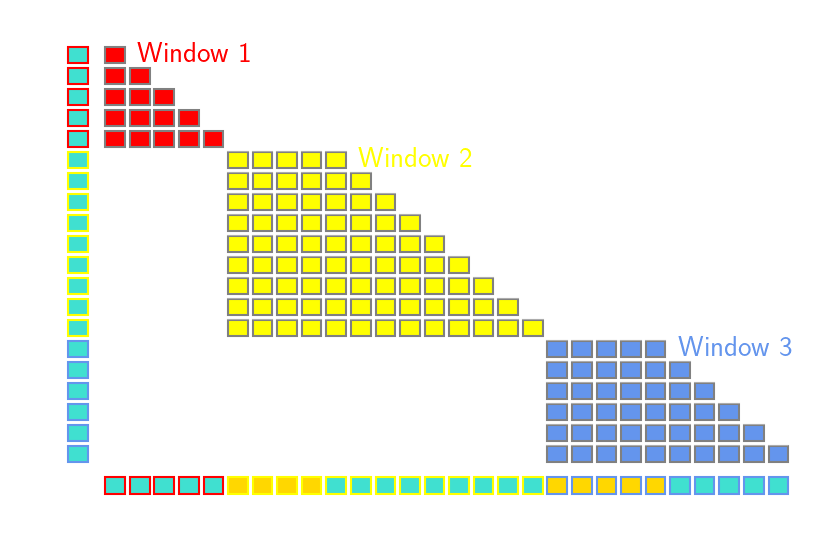
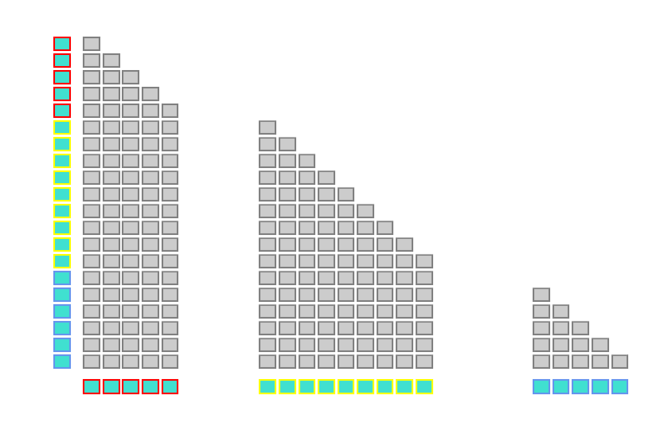

# CASA: Cross-Attention over Self-Attention for Efficient Vision-Language Fusion

[[Preprint]][casa-arxiv] [[Models on Hugging Face]](https://huggingface.co/collections/kyutai/casa) [[Project Page]][blog]

This repository contains inference code for the cross-attention-based VLMs presented in [CASA][casa-arxiv], along with example code for inference, evaluation and live video captioning. The weights (2B to 3B parameters) are available in our [Hugging Face collection](https://huggingface.co/collections/kyutai/casa), and additional qualitative samples in the [associated HuggingFace space](https://huggingface.co/spaces/kyutai/casa-samples).

All our models were trained with the standard HuggingFace Trainer API on a mixture of the [FineVision dataset](https://huggingface.co/spaces/HuggingFaceM4/FineVision) and a subset of [LLaVA-OneVision-1.5](https://huggingface.co/collections/lmms-lab/llava-onevision-15), covering image captioning, document and chart understanding, and general visual question answering. We plan to release training code in the future. For technical details, see our [project page][blog] and [preprint][casa-arxiv].

## CASA in a nutshell

In the CASA preprint, we revisit cross-attention (CA) as a fusion mechanism for VLMs. Our results suggest that cross-attention deserves renewed consideration as a practical and competitive alternative to token insertion, as applications move toward longer streaming multimodal inputs.

CASA models fuse vision and text through two mechanisms:

- **Self-attention layers** process only the text tokens, over the full context of the current sequence (_right_).
- **Cross-attention layers** process _both_ text and image tokens (as queries and keys/values respectively), but in local windows (_left_), defined by the points at which images occur in the stream, e.g. between two video frames.

To improve efficiency, we use sequence packing during training, and CASA layers leverage _block-wise attention_ from Flash Attention to implement the local window pattern.

<div align="center">
<table>
<tr>
<td align="center"></td>
<td align="center"></td>
</tr>
<tr>
<td align="center"></td>
<td align="center"></td>
</tr>
</table>
</div>

Because of the local windows, the models never accumulate image tokens in their KV cache: memory and compute stay almost constant in the number of images, as with a sliding window that only affects images and keeps the latest one. See [Streaming Inference Speed](#streaming-inference-speed) for measurements.

<div align="center">
<p align="center" width="100%">
<video src="https://github.com/user-attachments/assets/cb205fe2-11fb-4e8d-98ac-e1a250e5573b" width="80%" controls></video>
</p>
<p>
 The input video is taken from the Animal Kingdom dataset, and the subtitles displayed are generated with <code>CASA-Qwen2_5-VL-3B-LiveCC</code>.

Specifically, video frames are extracted at 2fps, and subtitles are displayed in real-time at the timestamp they are generated.</p>

  <p><small> <i><b>Transcript:</b> "This video shows a fox in the Arctic. The Arctic is an area of Earth that's covered by ice and snow year -round, and it gets very cold there. Foxes are adapted to live in this cold environment because they have a thick layer of fur to keep them warm when they're out in the snow. This fox is walking through the snow and looking around for food or maybe just for safety from predators like wolves or bears that might be around. Foxes are also known for their ability to jump really high and"</i></small></p>
</div>

## Model Weights

We release the following Vision-Language Models. In all cases, images are embedded with the Qwen2.5-VL visual encoder, whose last four blocks are fine-tuned before feeding visual features into the model.

### 🔹 **`kyutai/CASA-Helium1-VL-2B`**
A cross-attention based model built on [**Helium1-2B**](https://huggingface.co/kyutai/helium-1-2b), a **text-only LLM** which we fully fine-tune alongside CASA layers to produce a VLM which uses cross-attention fusion rather than token insertion. `kyutai/CASA-Helium1-VL-2B-Shared` is the parameter-sharing ($\text{CA}^{🔗}$) variant, where the self-attention and cross-attention layers in the same block share the same weights.

### 🔹 **`kyutai/Helium1-VL-2B`**
Our token-insertion baseline trained from Helium1-2B with direct token insertion. It achieves state-of-the-art performance among insertion-based models of comparable size trained with publicly available datasets.

### 🔹 **`kyutai/CASA-Qwen2_5-VL-3B`**
A cross-attention adapted version of [**Qwen2.5-VL-3B**](https://huggingface.co/Qwen/Qwen2.5-VL-3B-Instruct), a **pretrained VLM** which originally handles visual inputs by directly adding image tokens to its token stream. `kyutai/CASA-Qwen2_5-VL-3B-Shared` is the corresponding parameter-sharing variant.

### 🔹 **`kyutai/CASA-Qwen2_5-VL-3B-LiveCC`**
`CASA-Qwen2_5-VL-3B` further fine-tuned for live video captioning on [Live-WhisperX-526K](https://huggingface.co/datasets/chenjoya/Live-WhisperX-526K), an instruction-style video dataset of frames sampled at 2 fps interleaved with the transcripts of the original video audio.

## Inference

### Setup

We recommend using [uv](https://docs.astral.sh/uv/) to setup and run the code, as it will manage all Python dependencies for you transparently:

```bash
curl -LsSf https://astral.sh/uv/install.sh | sh
```

Each script in `scripts/` declares its dependencies inline (PEP 723), so `uv run scripts/<script>.py` works out of the box; `pyproject.toml` lists the minimal dependencies for inference. All scripts accept either a released model name (e.g. `CASA-Helium1-VL-2B`, expanded to `kyutai/CASA-Helium1-VL-2B`), a full Hugging Face repo id, or a path to a local checkpoint directory.

The video captioning scripts also need **FFmpeg**, which is not a Python dependency: `ffmpeg` re-encodes the subtitled video, and `torchcodec` links against the FFmpeg shared libraries to decode frames. If it is not already installed system-wide, [pixi](https://pixi.sh) provides it from the included `pixi.toml`:

```bash
curl -fsSL https://pixi.sh/install.sh | sh
pixi install
# then prefix the captioning commands below with `pixi run`, e.g.
pixi run uv run scripts/live_captioner.py --help
```

### Quick Start

Loading a model, processing inputs and running inference with the standard HuggingFace `transformers` pipeline (see also `scripts/test_infer.py`):

```python
import torch
from transformers.models.auto.modeling_auto import AutoModel
from transformers.models.auto.processing_auto import AutoProcessor

model_id = "kyutai/CASA-Helium1-VL-2B"
model = AutoModel.from_pretrained(
    model_id,
    torch_dtype=torch.bfloat16,
    attn_implementation="flash_attention_2",
    trust_remote_code=True,
).cuda()
processor = AutoProcessor.from_pretrained(
    model_id,
    trust_remote_code=True,
)

conversation = [
    {
        "role": "user",
        "content": [
            {
                "type": "image",
                "image": "assets/casa_attn.png",
            },
            {
                "type": "text",
                "text": "Describe this image.",
            },
        ],
    },
]
inputs = processor.tokenize_messages(messages=conversation)
inputs = inputs.to(model.device)
input_len = inputs["input_ids"].shape[1]
output_ids = model.generate_from_image(
    **inputs,
    max_new_tokens=512,
    pre_image_tokens=processor.pre_image_tokens,
    post_image_tokens=processor.post_image_tokens,
    eos_token_id=model.generation_config.eos_token_id,
)[0, input_len:]
response = processor.tokenizer.decode(output_ids, skip_special_tokens=True)
print(response)
```

### Live Captioning

`scripts/live_captioner.py` captions a video with `CASA-Qwen2_5-VL-3B-LiveCC` and re-encodes it with the subtitles embedded at the time they were generated (needs FFmpeg, see [Setup](#setup)).

```bash
# Script options
uv run scripts/live_captioner.py --help
# Generation with Qwen2.5VL+CASA
uv run scripts/live_captioner.py --sample_path path_to_video.mp4 --srt True --temp 0.0
# For long videos, you can also tweak the repetition penalty more precisely
uv run scripts/live_captioner.py --sample_path path_to_long_video.mp4 --repetition_penalty 1.15 --repetition_penalty_max_count 10 --repetition_penalty_decay 0.9
```

The captions are narrated with [pocket-tts](https://github.com/kyutai-labs/pocket-tts) in place of the original audio (`--tts_voice None` keeps the soundtrack, `--srt False` only dumps subtitles to JSON). Frames are fed to the vision tower at `--image_size` (default 448, training resolution for this model).

### Live Captioning Demo

`scripts/live_captioner_ui.py` is a small Gradio UI to watch the model caption in real time: the video plays at native speed while the model captions frames as fast as it can, streaming tokens over a single KV cache. Generation parameters (`fps`, `temp`, `repetition_penalty`, `prompt`, ...) can be set from the command line and tuned live in the interface.

```bash
uv run scripts/live_captioner_ui.py --model_id CASA-Qwen2_5-VL-3B-LiveCC --port 10060
```

Additional qualitative samples are available on our [project page][blog].

### Benchmark Evaluation

`scripts/eval.py` reproduces our reported results on standard VLM benchmarks, using [lmms-eval](https://github.com/EvolvingLMMs-Lab/lmms-eval) as the main evaluation pipeline.

```bash
# Display command options
uv run scripts/eval.py --help
# Run inference on the ai2d dataset for the Helium1+CASA model
uv run scripts/eval.py CASA-Helium1-VL-2B --dataset_name ai2d --batch_size 16 --image_size 896
# Same, distributed over 8 GPUs
uv run torchrun --nproc_per_node=8 scripts/eval.py CASA-Helium1-VL-2B --dataset_name ai2d --batch_size 16
# Evaluate on all datasets sequentially
bash scripts/run_all_evals.sh --model_id CASA-Helium1-VL-2B --batch_size 16 --img_size 896
```

Results below are at image resolution **896 pixels** run on 1 GPU; our models are shown in **bold**. Columns are grouped as **Document/Chart** (ChartQA, DocVQA, InfoVQA), **Scene Text** (OCRBench, TextVQA) and **Knowledge/QA** (RealWorldQA, AI2D, GQA, MME). See our [project page][blog] and [preprint][casa-arxiv] for additional evaluation.

| Model | ChartQA | DocVQA | InfoVQA | OCRBench | TextVQA | RealWorldQA | AI2D | GQA | MME |
|:------|:-------:|:------:|:-------:|:--------:|:-------:|:-----------:|:----:|:---:|:----:|
| **Helium1-VL-2B** | 79.2 | 88.3 | 58.9 | 746 | 75.0 | 59.6 | 65.5 | 54.2 | 1665 |
| **CASA-Helium1-VL-2B** | 77.6 | 86.3 | 55.1 | 740 | 75.5 | 58.2 | 66.0 | 55.6 | 1722 |
| **CASA-Helium1-VL-2B-Shared** | 75.2 | 85.8 | 52.0 | 728 | 74.5 | 58.3 | 66.2 | 55.7 | 1637 |
| mPLUG-Owl3 8B | 59.2† | 55.9† | 36.8† | 527† | 69.0 | 63.9† | 73.4 | 65.0 | 1940† |
| mPLUG-Owl3 2B | 48.5† | 48.2† | 28.1† | 450† | 62.6 | 56.9† | 62.6 | 61.0 | 1551† |

<sup>†</sup> Reproduced with the publicly available models on Hugging Face.

*`CASA-Helium1-VL-2B` compared to a recent cross-attention baseline (mPLUG-Owl3) and our token-insertion model `Helium1-VL-2B` trained in the same conditions. Our model outperforms current SoTA cross-attention-based VLMs and remains competitive with our token-insertion baseline trained in the same conditions*

| Model | ChartQA | DocVQA | InfoVQA | OCRBench | TextVQA | RealWorldQA | AI2D | GQA | MME |
|:------|:-------:|:------:|:-------:|:--------:|:-------:|:-----------:|:----:|:---:|:----:|
| Qwen2.5-VL-3B | 84.0 | 93.6 | 77.1 | 797 | 79.3 | 62.2† | 81.6 | 61.0† | 2249† |
| **CASA-Qwen2_5-VL-3B** | 81.8 | 87.9 | 58.2 | 796 | 76.5 | 62.1 | 76.1 | 59.4 | 1971 |
| **CASA-Qwen2_5-VL-3B-Shared** | 81.4 | 87.8 | 59.1 | 797 | 76.6 | 63.0 | 74.3 | 59.2 | 2075 |

<sup>†</sup> Reproduced with the publicly available models on Hugging Face.

*`CASA-Qwen2_5-VL-3B`, adapted from Qwen2.5-VL, reaches performance close to the original insertion-based model. The only significant gap remains on the InfoVQA benchmark*

### Streaming Inference Speed

`scripts/speed_bench_streaming.py` measures inference speed and memory in the live captioning setting, for a configurable number of turns and generated text tokens per turn:

```bash
# Script options
uv run scripts/speed_bench_streaming.py --help
# 256 turns of one frame + 16 generated tokens each
uv run scripts/speed_bench_streaming.py CASA-Qwen2_5-VL-3B --num_turns 256 --tokens_per_turn 16
```

Each turn appends one 896×896 frame and 16 greedily generated text tokens to a persistent KV cache, at batch size 1, mirroring the live captioning loop. We report time-to-first-token (encoding + prefill of the new frame) and decoding throughput averaged over the first and last 10% of the session, along with the final KV cache length and peak memory, on a single H100 80GB GPU.

**256-turn session**

| Model | TTFT (ms) first → last turns | Decode tok/s first → last turns | Final KV cache (tokens) | Peak mem (GiB) |
|:------|:----------------------------:|:-------------------------------:|:-----------------------:|:--------------:|
| Helium1-VL-2B | 80 → 459 | 89.5 → 20.1 | 266,773 | 34.2 |
| **CASA-Helium1-VL-2B** | 64 → 64 | 59.2 → 58.9 | 4,629 | 6.4 |
| **CASA-Helium1-VL-2B-Shared** | 65 → 65 | 59.0 → 59.1 | 4,629 | 5.7 |
| **CASA-Qwen2_5-VL-3B** | 74 → 73 | 40.7 → 40.6 | 4,653 | 8.1 |
| **CASA-Qwen2_5-VL-3B-Shared** | 74 → 74 | 40.5 → 40.6 | 4,653 | 7.4 |

**512-turn session**

| Model | TTFT (ms) first → last turns | Decode tok/s first → last turns | Final KV cache (tokens) | Peak mem (GiB) |
|:------|:----------------------------:|:-------------------------------:|:-----------------------:|:--------------:|
| Helium1-VL-2B | 111 → 917 | 81.1 → 10.9 | 533,525 | 63.2 |
| **CASA-Helium1-VL-2B** | 63 → 66 | 59.5 → 59.6 | 9,237 | 6.8 |
| **CASA-Helium1-VL-2B-Shared** | 64 → 67 | 59.9 → 59.3 | 9,237 | 6.2 |
| **CASA-Qwen2_5-VL-3B** | 74 → 74 | 40.4 → 40.7 | 9,261 | 8.2 |
| **CASA-Qwen2_5-VL-3B-Shared** | 74 → 73 | 40.1 → 41.0 | 9,261 | 7.6 |

*The insertion model accumulates ~1k image tokens per frame in its KV cache, so its cost grows with session length: Over 256 turns prefill latency grows 5.7× and decoding slows down 4.5×, over 512 turns 8.3× and 7.4× respectively, with memory growing linearly to 63 GiB — a longer session goes out of memory on an 80 GB GPU. The CASA models keep only text in the KV cache and cross-attend to the latest frame, so latency and throughput are flat within a session and unchanged between the two session lengths, at a fraction of the memory.*

## License

The present code is provided under the **MIT license**, and the model weights under the **CC-BY-NC-SA 4.0 license**.

Some of the model weights include weights from the Qwen2.5-VL-3B model (namely, the image encoder for the Helium1-based models, as well as the VLM backbone for `CASA-Qwen2_5-VL-3B` and its `-Shared` and `-LiveCC` variants). Qwen is licensed under the **Qwen RESEARCH LICENSE AGREEMENT**, Copyright (c) Alibaba Cloud. All Rights Reserved.

## Citation

If you use this repository in your research, please cite:

```
@article{kyutai2025casa,
  author = {Moritz B\"ohle and Am\'elie Royer and Juliette Marrie and Edouard Grave and Patrick P\'erez},
  year = {2025},
  title = {CASA: Cross-Attention over Self-Attention for Efficient Vision-Language Fusion},
  journal = {ArXiv},
  url = {https://arxiv.org/abs/2512.19535}
}
```

[blog]: https://kyutai.org/casa
[casa-arxiv]: https://arxiv.org/abs/2512.19535
